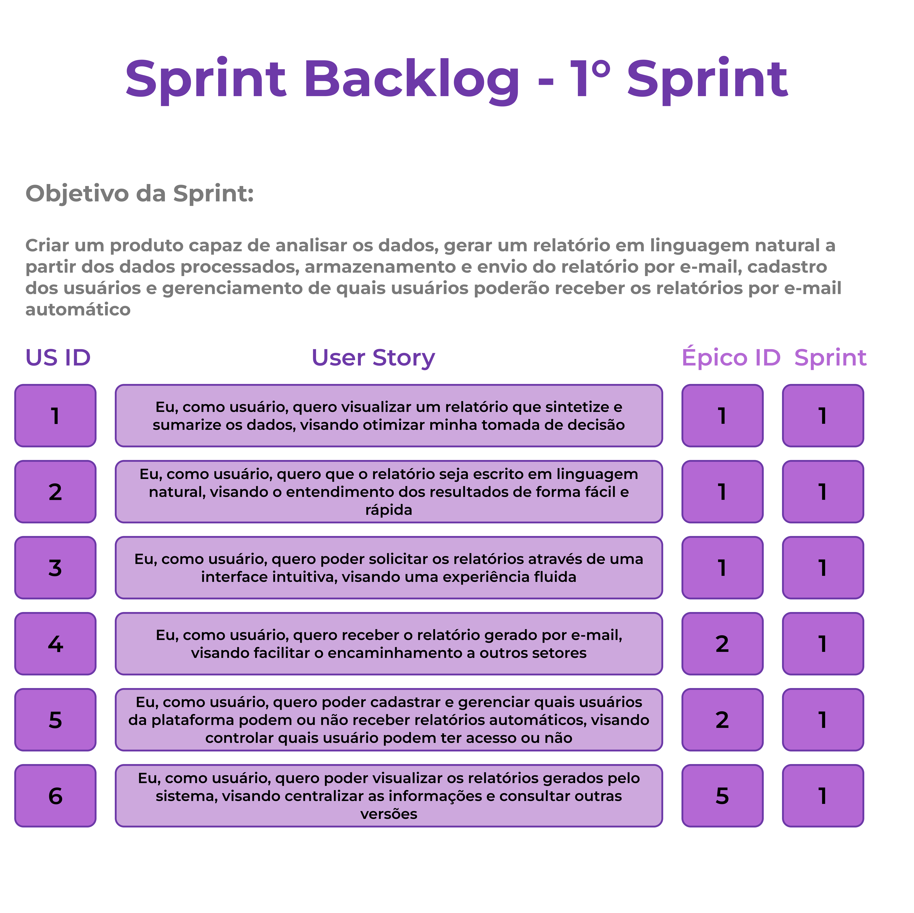
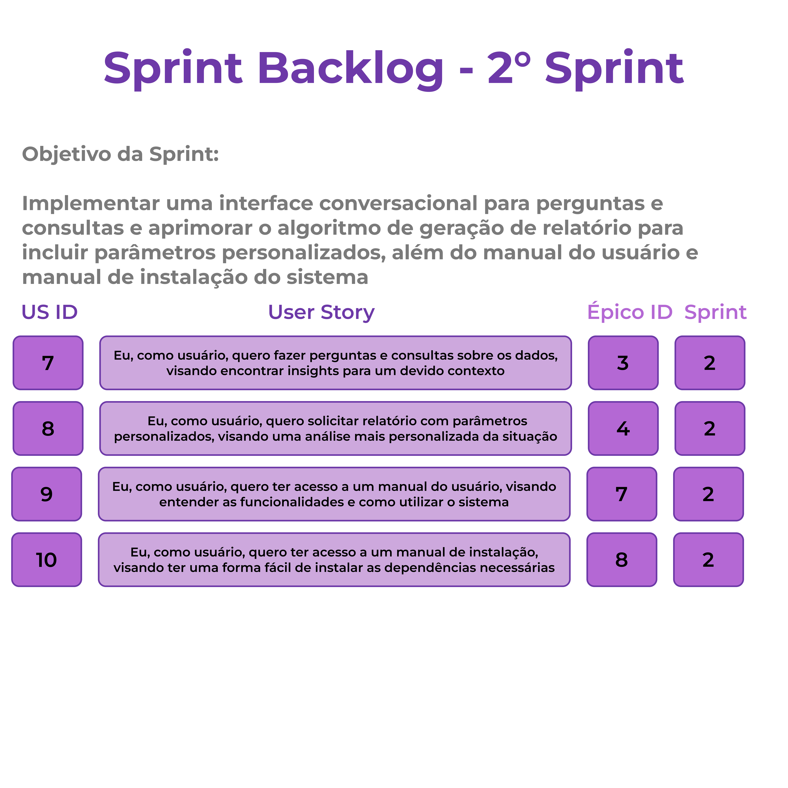
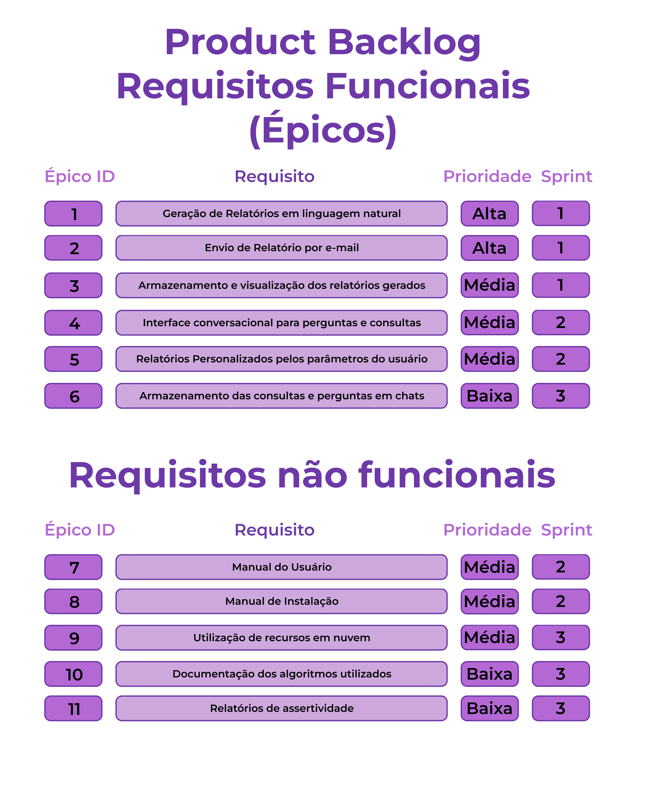

<!-- Para melhor visualização do código, tire a quebra de linha automatica. -->
 

<h1> FATEC Profº Jessen Vidal - São José dos Campos - 6º Semestre DSM </h1>

    
<h2> 💻 Sobre o projeto: </h2>
O projeto para API (Aprendizagem por Projeto Integrado) do 6° semestre de Desenvolvimento de Software Multiplataforma (DSM) tem como objetivo desenvolver um sistema de busca semântica que transforme grandes volumes de dados estruturados em relatórios e em uma interface de conversação em linguagem natural. A partir de um dataset fornecido pela empresa parceira (Dom Rock), com informações diárias de vendas e movimentação de estoque desde janeiro de 2024, a solução busca facilitar a compreensão do contexto operacional da empresa, oferecendo visões executivas, gerenciais e estratégicas. Assim, gestores poderão obter análises rápidas, claras e acessíveis para apoiar a tomada de decisão.
 

<h3> 📌 Status do projeto: Em Andamento ⏳ </h3>

 

    
<h3> 👾 Tecnologias utilizadas até o momento: </h3>

 

<h2> 🎯 MVP </h2>

 

    
<h2> 🚩 Sprints </h2>

<table >
    <tr>
        <th> Sprint </th>
        <th> Início </th>
        <th> Entrega </th>
        <th> Status </th>
        <th> Relatório </th>
        <!--<th> Wiki </th>-->
        <!--<th> Status </th>-->
    </tr>
    <tr align="center">
        <td> 1 </td>
        <td> 08/09/2025 </td>
        <td> 28/09/2025 </td>
        <td> ✔️ </td>
        <td> <a href="https://github.com/Equipe-CodeLand/API-2025.2/wiki/API%E2%80%902025.2-%E2%80%90-Sprint-1">Wiki</a> </td>
        <!--<td> Concluída </td>-->
    </tr>
     <tr align="center">
        <td> 2 </td>
        <td> 06/10/2025 </td>
        <td> 26/10/2025 </td>
        <td> ✔️</td>
        <td> <a href="https://github.com/Equipe-CodeLand/API-2025.2/wiki/API%E2%80%902025.2-%E2%80%90-Sprint-2">Wiki</a> </td>
        <!--<td> Concluída </td> -->
    </tr>
    <tr align="center">
        <td> 3 </td>
        <td> 03/11/2025 </td>
        <td> 23/11/2025 </td>
        <td> ✖ </td>
        <td> </td>
    </tr>
</table>

 

## Backlog Primeira Sprint

## Backlog Segunda Sprint

### Requisitos

### User Stories

## Padrão de Commit

<h2> 👨‍💻 Equipe </h2>
    
<table>
    <tr>
        <th> Foto </th>
        <th> Função </th>
        <th> Nome </th>
        <th> Linkedin </th>
        <th> Git Hub </th>
    </tr>
    <tr>
          <td>  </td>
          <td> Scrum Master </td>
          <td> Pedro Henrique de Souza </td>
          <td>  </td>
          <td>  </td>
      </tr>
    <tr>
        <td> </td>
        <td> Product Owner </td>
        <td> Felipe Gabriel Vieira </td>
        <td>  </td>
        <td>  </td>
    </tr>
    <tr>
        <td> </td>
        <td> Dev Team </td>
        <td> André Felipe da Costa </td>
        <td>  </td>
        <td>  </td>
    </tr>
  <tr>
     <td> </td>
          <td> Dev Team </td>
          <td> Laura Gabriel Gonçalves </td>
          <td>  </td>
    <td>  </td>
    </tr>
  </tr>
  <tr>
     <td>  </td>
          <td> Dev Team </td>
          <td> Letícia Helena de Oliveira Carvalho </td>
          <td>  </td>
    <td>  </td>
    </tr>
  </tr>
    <tr>
        <td>  </td>
        <td> Dev Team </td>
        <td> Livia Alves de Faria </td>
        <td>  </td>
        <td>  </td>
    </tr>
    <tr>
        <td>  </td>
        <td> Dev Team </td>
        <td> Víctor dos Santos Salles </td>
        <td>  </td>
        <td>  </td>
    </tr>
</table>
    
 

<a href="#topo">[Voltar ao topo]</a>
